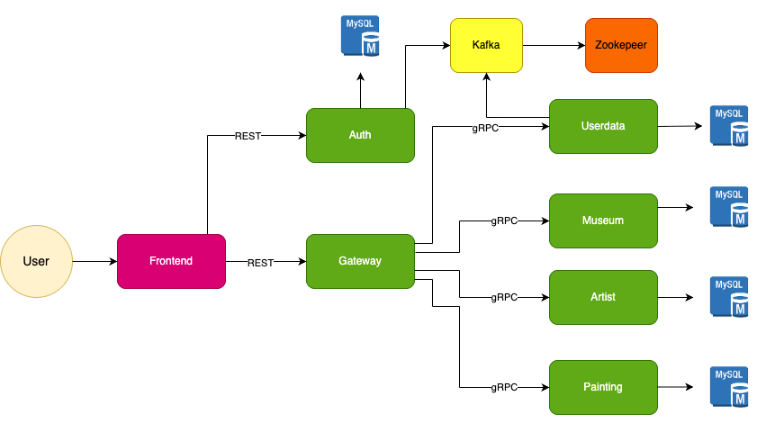
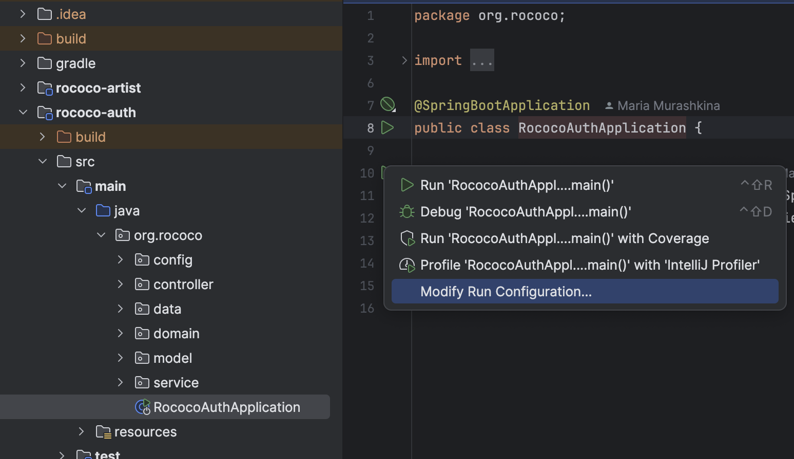
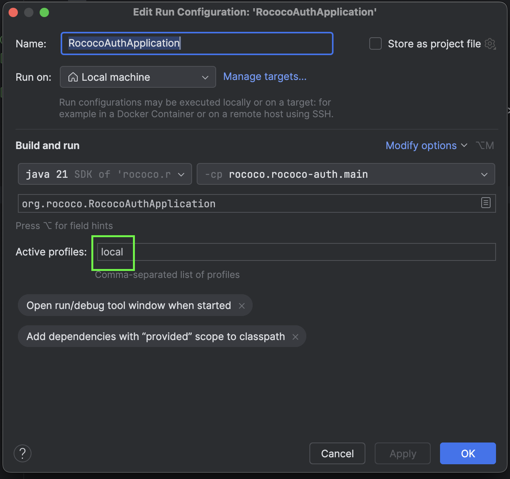
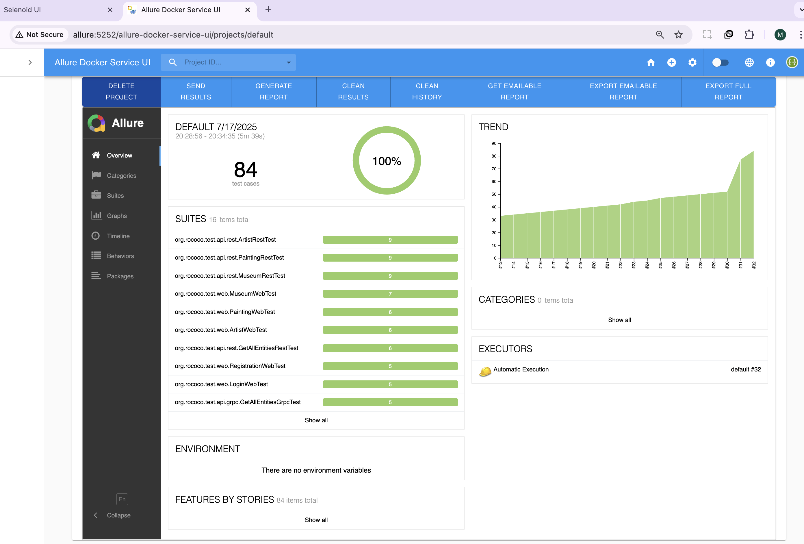

# Rococo

Приветствую! Проект Rococo - результат полученных знаний и умений в уникальной школе QA.GURU. Хочу поделиться
с вами моим первым опытом написания микросервисов и покрытием этих микросервисов интеграционными и unit тестами.

## Технологический стек

- [Spring Authorization Server](https://spring.io/projects/spring-authorization-server)
- [Spring OAuth 2.0 Resource Server](https://docs.spring.io/spring-security/reference/servlet/oauth2/resource-server/index.html)
- [Spring data JPA](https://spring.io/projects/spring-data-jpa)
- [Spring Web](https://docs.spring.io/spring-framework/docs/current/reference/html/web.html#spring-web)
- [Spring actuator](https://docs.spring.io/spring-boot/docs/current/reference/html/actuator.html)
- [Spring gRPC by https://github.com/yidongnan](https://yidongnan.github.io/grpc-spring-boot-starter/en/server/getting-started.html)
- [Apache Kafka](https://developer.confluent.io/quickstart/kafka-docker/)
- [Docker](https://www.docker.com/resources/what-container/)
- [Docker-compose](https://docs.docker.com/compose/)
- [MySQL](https://downloads.mysql.com/docs/refman-8.3-en.pdf)
- [Svelte](https://svelte.dev/docs/svelte/overview)
- [Thymeleaf](https://www.thymeleaf.org/)
- [Jakarta Bean Validation](https://beanvalidation.org/)
- [JUnit 5 (Extensions, Resolvers, etc)](https://junit.org/junit5/docs/current/user-guide/)
- [Retrofit 2](https://square.github.io/retrofit/)
- [Allure](https://docs.qameta.io/allure/)
- [Selenide](https://selenide.org/)
- [Selenoid & Selenoid-UI](https://aerokube.com/selenoid/latest/)
- [Allure-docker-service](https://github.com/fescobar/allure-docker-service)
- [Java 21](https://adoptium.net/en-GB/temurin/releases/)
- [Gradle 8.6](https://docs.gradle.org/8.6/release-notes.html)
- [GHA](https://docs.github.com/en/actions)

# Схема проекта ROCOCO



# Минимальные предусловия для работы с проектом ROCOCO

#### 1. Установить Docker

[Установка на Windows](https://docs.docker.com/desktop/install/windows-install/)

[Установка на Mac](https://docs.docker.com/desktop/install/mac-install/) (Для ARM и Intel разные пакеты)

[Установка на Linux](https://docs.docker.com/desktop/install/linux-install/)

Для проверки работы команд docker введите `docker -v`:

```posh
User-MacBook-Pro ~ % docker -v
Docker version 20.10.14, build a224086
```

#### 2. Спуллить контейнер mysql:8.3.0, zookeeper и kafka версии 7.3.2

```posh
docker pull mysql:8.3.0
docker pull confluentinc/cp-zookeeper:7.3.2
docker pull confluentinc/cp-kafka:7.3.2
```

Для проверки введите команду `docker images`

```posh
mitriis-MacBook-Pro ~ % docker images            
REPOSITORY                 TAG              IMAGE ID       CREATED         SIZE
postgres                   15.1             9f3ec01f884d   10 days ago     379MB
confluentinc/cp-kafka      7.3.2            db97697f6e28   12 months ago   457MB
confluentinc/cp-zookeeper  7.3.2            6fe5551964f5   7 years ago     451MB

```

#### 3. Создать volume для сохранения данных из БД в docker на вашем компьютере

```posh
docker volume create mysql-data
```

#### 4. Запустить БД, zookeeper и kafka 3-мя последовательными командами:

Запустив скрипт (Для Windows необходимо использовать bash terminal: gitbash, cygwin или wsl)

```posh
User-MacBook-Pro  rococo % bash localenv.sh
```

Или выполнив последовательно команды, для *nix:

```posh
docker run --name rococo-db -p 3306:3306 -e MYSQL_ROOT_PASSWORD=secret -v mysql-data:/var/lib/mysql -v ./my.cnf:/etc/mysql/conf.d/custom.cnf -d mysql:8.3.0

docker run --name=zookeeper -e ZOOKEEPER_CLIENT_PORT=2181 -p 2181:2181 -d confluentinc/cp-zookeeper:7.3.2

docker run --name=kafka -e KAFKA_BROKER_ID=1 \
-e KAFKA_ZOOKEEPER_CONNECT=$(docker inspect zookeeper --format='{{ .NetworkSettings.IPAddress }}'):2181 \
-e KAFKA_ADVERTISED_LISTENERS=PLAINTEXT://localhost:9092 \
-e KAFKA_OFFSETS_TOPIC_REPLICATION_FACTOR=1 \
-e KAFKA_TRANSACTION_STATE_LOG_MIN_ISR=1 \
-e KAFKA_TRANSACTION_STATE_LOG_REPLICATION_FACTOR=1 \
-p 9092:9092 -d confluentinc/cp-kafka:7.3.2
```

Для Windows (Необходимо использовать bash terminal: gitbash, cygwin или wsl):

```posh
docker run --name rococo-db -p 3306:3306 -e MYSQL_ROOT_PASSWORD=secret -v mysql-data:/var/lib/mysql -v ./my.cnf:/etc/mysql/conf.d/custom.cnf -d mysql:8.3.0

docker run --name=zookeeper -e ZOOKEEPER_CLIENT_PORT=2181 -p 2181:2181 -d confluentinc/cp-zookeeper:7.3.2

docker run --name=kafka -e KAFKA_BROKER_ID=1 -e KAFKA_ZOOKEEPER_CONNECT=$(docker inspect zookeeper --format="{{ .NetworkSettings.IPAddress }}"):2181 -e KAFKA_ADVERTISED_LISTENERS=PLAINTEXT://localhost:9092 -e KAFKA_OFFSETS_TOPIC_REPLICATION_FACTOR=1 -e KAFKA_TRANSACTION_STATE_LOG_MIN_ISR=1 -e KAFKA_TRANSACTION_STATE_LOG_REPLICATION_FACTOR=1 -p 9092:9092 -d confluentinc/cp-kafka:7.3.2
```
#### 5. Установить Java версии 21

Версию установленной Java необходимо проверить командой `java -version`

```posh
User-MacBook-Pro ~ % java -version
openjdk version "21.0.1" 2023-10-17 LTS
OpenJDK Runtime Environment Temurin-21.0.1+12 (build 21.0.1+12-LTS)
OpenJDK 64-Bit Server VM Temurin-21.0.1+12 (build 21.0.1+12-LTS, mixed mode)
```
#### 6. Установить пакетый менеджер для сборки front-end npm

[Инструкция](https://docs.npmjs.com/downloading-and-installing-node-js-and-npm).
Рекомендованная версия Node.js - 22.6.0

# Запуск ROCOCO локальное в IDE:

#### 1. Перейти в папку rococo-client

```posh
User-MacBook-Pro rococo % cd rococo-client
```

#### 2. Запустить фронтенд (сначала обновить зависимости)

```posh
User-MacBook-Pro rococo-client % npm i
User-MacBook-Pro rococo-client % npm run dev
```

#### 3. Прописать run конфигурацию для всех сервисов rococo-* - Active profiles local

Для этого можно открыть main-класс в src/main/java и правой кнопкой открыть меню настроек запуска приложения:

 

#### 4 Запустить сервис rococo-auth c помощью gradle или командой Run в IDE:

- Запустить сервис auth

```posh
User-MacBook-Pro rococo % cd rococo-auth
User-MacBook-Pro rococo-auth % gradle bootRun --args='--spring.profiles.active=local'
```

Или просто перейдя к main-классу приложения RococoAuthApplication выбрать run в IDEA (предварительно удостовериться что
выполнен предыдущий пункт)

#### 5  Запустить в любой последовательности другие сервисы: rococo-userdata, rococo-gateway, rococo-artist, rococo-museum, rococo-painting

Начать работу с запущенным приложением можно открыв в браузере Rococo frontend по адресу http://127.0.0.1:3000/

# Запуск ROCOCO в докере:

#### 1. Создать бесплатную учетную запись на https://hub.docker.com/ (если отсутствует)

#### 2. Создать в настройках своей учетной записи access_token

[Инструкция](https://docs.docker.com/docker-hub/access-tokens/).

#### 3. Выполнить docker login с созданным access_token (в инструкции это описано)

#### 4. Прописать в etc/hosts элиас для Docker-имени

127.0.0.1       client.rococo.dc
127.0.0.1       auth.rococo.dc
127.0.0.1       gateway.rococo.dc
127.0.0.1       allure

```posh
User-MacBook-Pro rococo % vi /etc/hosts
```

```posh
##
# Host Database
#
# localhost is used to configure the loopback interface
# when the system is booting.  Do not change this entry.
##
127.0.0.1       localhost
127.0.0.1       client.rococo.dc
127.0.0.1       auth.rococo.dc
127.0.0.1       gateway.rococo.dc
127.0.0.1       allure
```

#### 5. Перейти в корневой каталог проекта

```posh
User-MacBook-Pro rococo % cd rococo
```

#### 6. Запустить все сервисы

```posh
User-MacBook-Pro  rococo % bash docker-compose-dev.sh
```
Начать работу с запущенным приложением можно открыв в браузере Rococo frontend по адресу http://rococo.client.dc

# Запуск e-2-e тестов в Docker:

#### 1. Перейти в корневой каталог проекта

```posh
User-MacBook-Pro rococo % cd rococo
```

#### 2. Запустить все сервисы и тесты:

```posh
User-MacBook-Pro  rococo % bash docker-compose-e2e.sh
```
#### 3. Selenoid UI доступен по адресу: http://127.0.0.1:9091

#### 4. Allure доступен по адресу: http://allure:5252/allure-docker-service-ui/projects/mariamur-rococo




